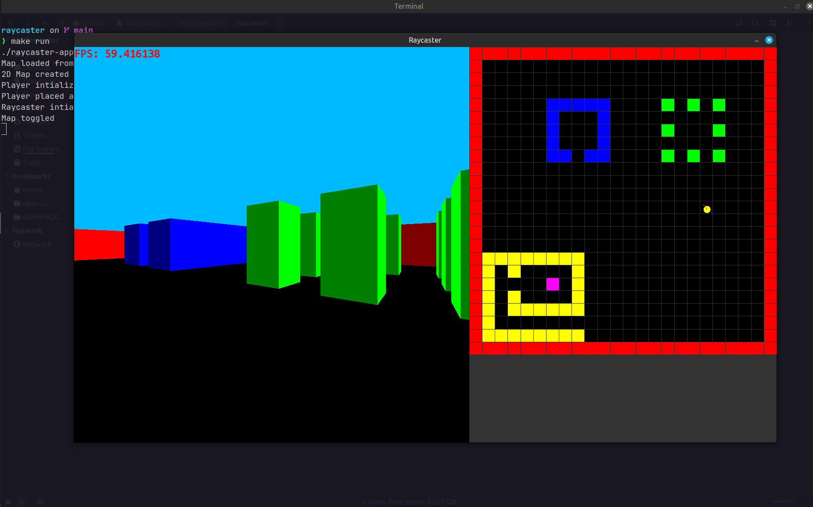

# Raycaster

A simple Wolfenstein-3D style raycaster written in modern C++ (C++17) using the SFML 3.0.2 library for rendering.
Implements a basic raycasting engine based on the DDA algorithm, a minimap view, player movement and rotation, along with basic collision detecion and wall shading.

---

### Features
- DDA raycasting per vertical screen column
- Perspective-correct wall rendering with side-based shading
- Toggleable 2D minimap (scaled and positioned to the right of the 3D view)
- Two built-in map layouts (small and large) demonstrated as arrays
- Player movement and rotation with collision checks
- Minimal, easy-to-read code organized around Map, Player, Raycaster and Map2D

---

### Screenshot

---

### Controls
- W — move forward
- S — move backward
- A — rotate left
- D — rotate right
- M — toggle 2D minimap overlay
- Q — quit
